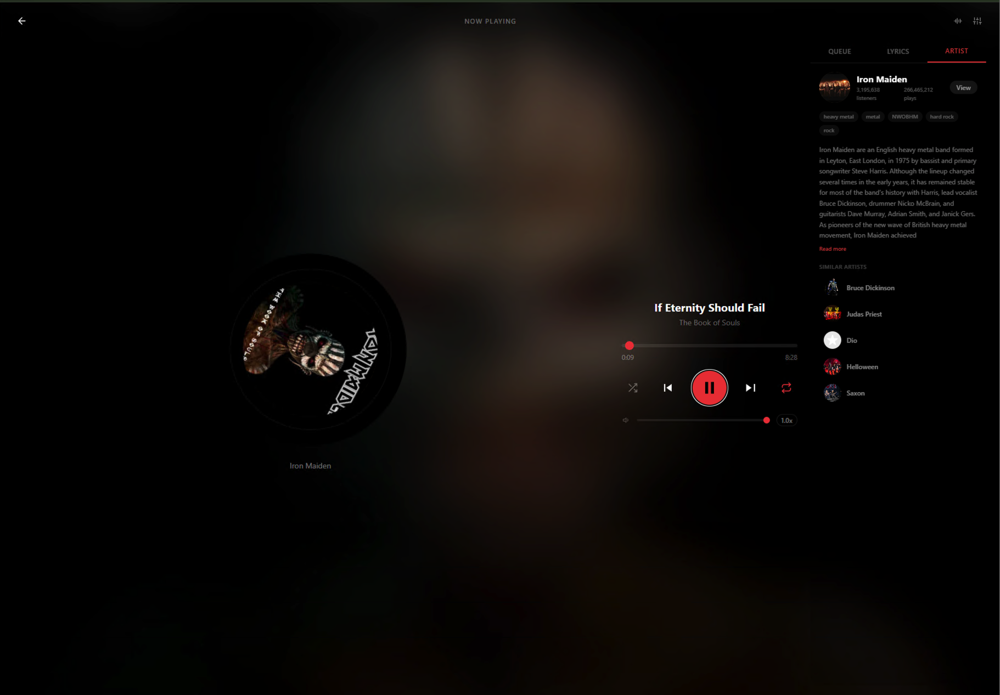
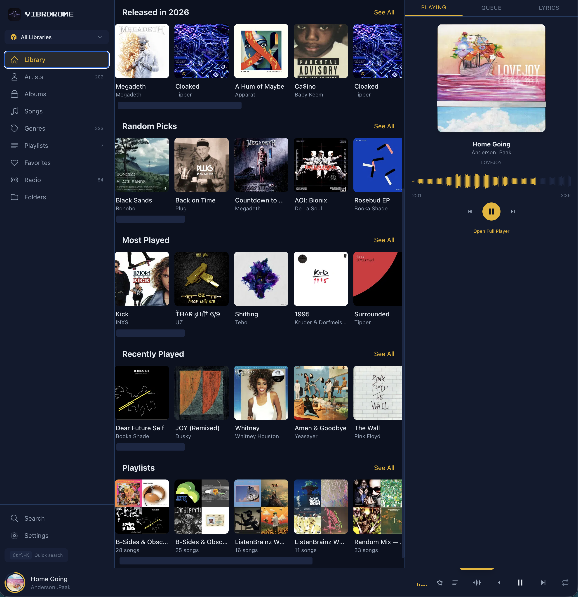
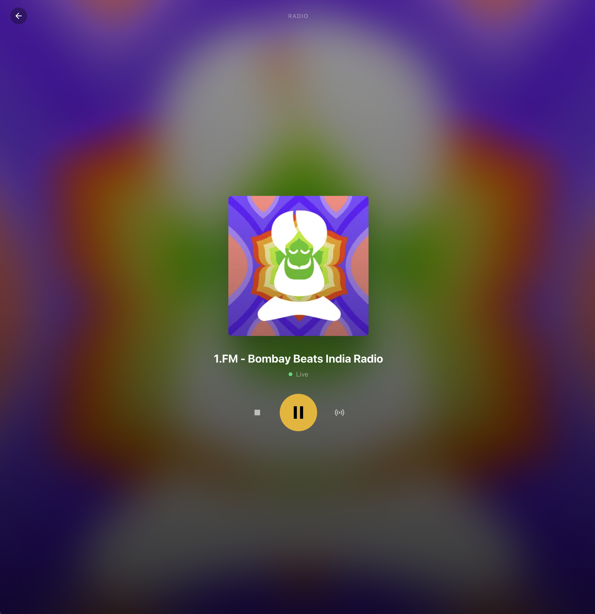
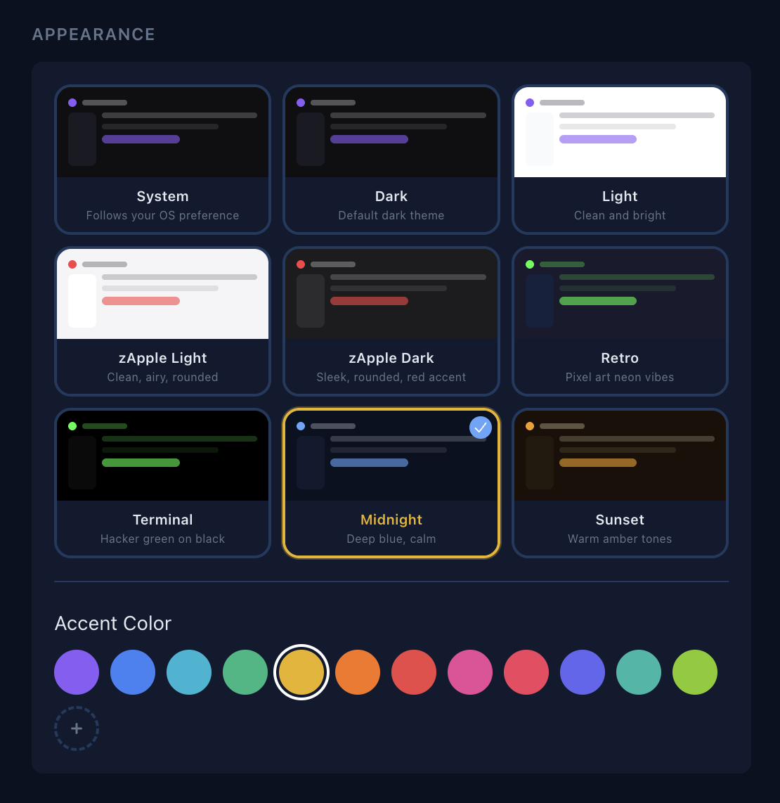
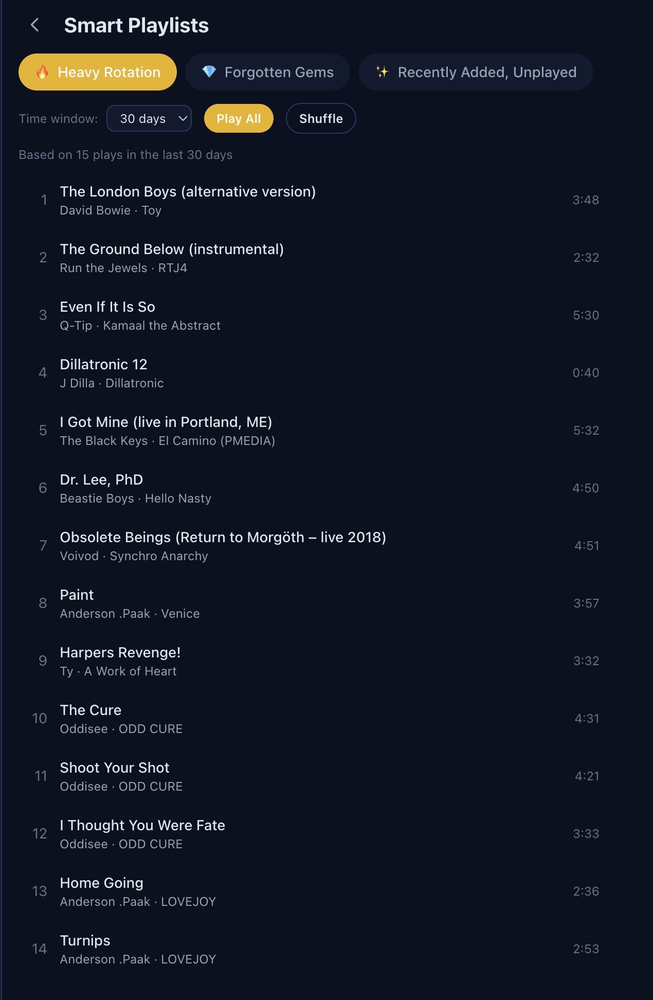
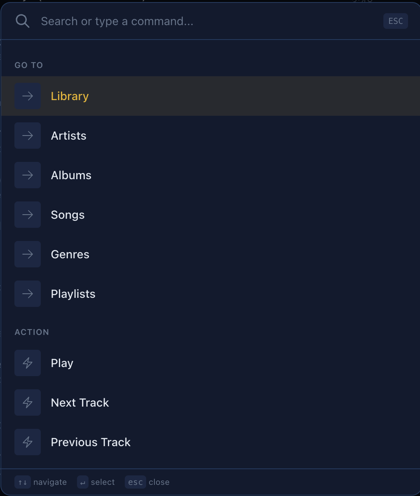

```
 __     __  ___   ____    ____    ____    ____     ___    __  __   _____
 \ \   / / |_ _| | __ )  |  _ \  |  _ \  |  _ \   / _ \  |  \/  | | ____|
  \ \ / /   | |  |  _ \  | |_) | | | | | | |_) | | | | | | |\/| | |  _|
   \ V /    | |  | |_) | |  _ <  | |_| | |  _ <  | |_| | | |  | | | |___
    \_/    |___| |____/  |_| \_\ |____/  |_| \_\  \___/  |_|  |_| |_____|
```

### ♪♫(◕‿◕)♫♪ *A modern web music player for Navidrome & Subsonic*

**[Try it live at web.vibrdrome.io](https://web.vibrdrome.io)**














---

## ♪(๑ᴖ◡ᴖ๑)♪ Features

**Library & Browsing**
- Stream your full music library from any Navidrome/Subsonic server
- Album, artist, genre, and folder browsing with responsive grid layouts
- Customizable library — reorder & show/hide shortcuts and carousels
- Custom carousels — filter by year range, genre (multi-select), decade, playlist, or top rated
- Music folder picker — switch between libraries on multi-folder servers
- Playlist management with artwork (Navidrome 0.61+)
- Search across your entire collection
- Command palette (Ctrl+K / Cmd+K) — search anything, navigate anywhere
- Filters on Artists (name, genre), Albums (name, artist, genre, year), and Songs (artist, genre, year)
- Artist radio — one-click play similar songs/top songs for any artist
- Multi-select with batch actions (Play, Play Next, Add to Queue)
- Smart playlists: Heavy Rotation, Forgotten Gems, Recently Added Unplayed (configurable thresholds)
- Browse similar artist bios inline without leaving the page

**Playback** ♪┏(・o･)┛♪
- Drag-and-drop queue reorder with up/down arrows for touch
- Shuffle, repeat (all/one), and crossfade
- 10-band equalizer with limiter (prevents bass boost clipping)
- Stream quality picker: Original, 320k, 256k, 192k, 128k, 96k
- Waveform seekbar — canvas-rendered audio waveform with click/drag to seek
- Playback speed control
- Sleep timer with fade-out
- Scrobbling and now playing reporting
- Keyboard shortcuts (Space, arrows, M, S, R) — toggle in Settings
- Play history tracking for future smart playlists

**Split-Pane Desktop View**
- Persistent right panel with Playing, Queue, and Lyrics tabs
- Browse your library while controlling playback
- Waveform seekbar and transport controls in the side panel
- Synced lyrics with click-to-seek (contained scrolling — no layout shift)

**Desktop Now Playing** (ﾉ◕ヮ◕)ﾉ
- Spinning vinyl album art with blurred background
- Three-column layout: album art | controls | queue/lyrics/artist
- Waveform seekbar replacing flat progress bar
- Artist spotlight — bio, tags, stats, similar artists (via Last.fm)
- Browse similar artist bios inline without leaving the player
- Artist images from your library or Wikimedia Commons

**Mini Player**
- Progress ring around spinning album art
- Live waveform visualizer bars
- Quick actions: star, lyrics, visualizer, previous, next, repeat, volume
- Pop-out mini player: draggable floating window with S/M/L/XL sizes and scalable waveform

**Visualizer**
- 6 WebGL shader presets (Plasma, Kaleidoscope, Tunnel, Fractal Pulse, Nebula, Warp Speed)
- Milkdrop mode via Butterchurn
- Photosensitivity warning with accessibility controls

**Radio**
- Internet radio with PLS/M3U playlist support
- Station artwork from Navidrome 0.61+

**Themes** (⌐■_■)
- 8 built-in themes: Dark, Light, zApple Light, zApple Dark, Retro, Terminal, Midnight, Sunset
- Custom accent color picker with 12 presets + hex input
- Per-theme fonts (pixel font for Retro, monospace for Terminal)

**Design**
- Responsive grid layouts — Artists, Albums, Genres, Playlists, Radio, Folders
- Sidebar with library counts (artists, genres, playlists, radio)
- Offline-capable PWA
- Share buttons on albums, artists, and playlists
- Docker support for self-hosting

---

## (ﾉ◕ヮ◕)ﾉ Getting Started

### Prerequisites

- [Node.js](https://nodejs.org/) 20+
- A running [Navidrome](https://www.navidrome.org/) or Subsonic-compatible server

### Install and Run

```bash
git clone https://github.com/ddmoney420/vibrdrome-web.git
cd vibrdrome-web
npm install
npm run dev
```

Open `http://localhost:5173` and enter your server URL and credentials.

### Build for Production

```bash
npm run build
```

Output lands in `dist/` — deploy to any static host (Cloudflare Pages, Vercel, Netlify, etc.).

### Run Tests

```bash
npm run test:run    # Run once
npm run test        # Watch mode
```

120 tests across 11 suites covering stores, API clients, utilities, and hooks.

### Docker

```bash
docker pull ddmoney420/vibrdrome-web
docker run -p 8080:80 ddmoney420/vibrdrome-web
```

Or build from source:

```bash
docker build -t vibrdrome-web .
docker run -p 8080:80 vibrdrome-web
```

Docker Compose:

```yaml
services:
  vibrdrome-web:
    image: ddmoney420/vibrdrome-web
    ports:
      - "8080:80"
    restart: unless-stopped
```

---

## (⌐■_■) Tech Stack

| Tech | What |
|------|------|
| **React 19** | UI framework |
| **TypeScript** | Type safety |
| **Vite 8** | Build tool |
| **Tailwind CSS 4** | Styling |
| **Zustand** | State management |
| **Web Audio API** | EQ & visualizer |
| **Butterchurn** | Milkdrop visualizations |
| **Last.fm API** | Artist bios & similar artists |
| **MusicBrainz + Wikimedia** | Artist images |

---

## Optional Integrations

Add API keys in **Settings > Integrations** to unlock extra features:

| Service | Feature | Key |
|---------|---------|-----|
| **Last.fm** | Artist bios, similar artists, tags | Free at [last.fm/api](https://www.last.fm/api/account/create) |

---

## Other Vibrdrome Apps ヽ(>∀<)ノ

| Platform | Link |
|----------|------|
| iOS / macOS | [vibrdrome.io](https://vibrdrome.io) |
| Android | [vibrdrome.io](https://vibrdrome.io) |
| Web | [web.vibrdrome.io](https://web.vibrdrome.io) |

---

## (♥‿♥) Community

- **Website:** [vibrdrome.io](https://vibrdrome.io)
- **Discord:** [Join the server](https://discord.gg/9q5uw3CfN)
- **GitHub Issues:** [Report bugs or request features](https://github.com/ddmoney420/vibrdrome-web/issues)

---

## Contributing

Contributions are welcome! ♪♫(◕‿◕)♫♪

1. Fork the repo
2. Create a feature branch (`git checkout -b feature/my-feature`)
3. Commit your changes
4. Push to the branch and open a PR

---

## License

[MIT](LICENSE)
